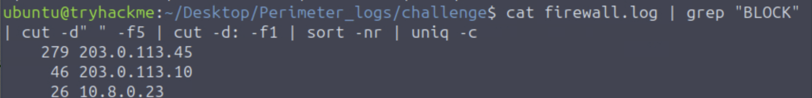
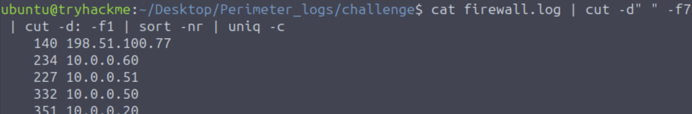
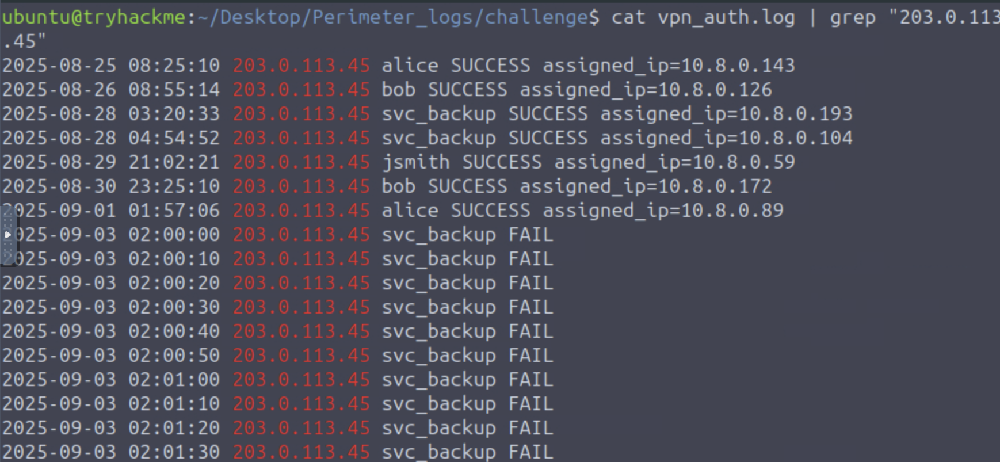
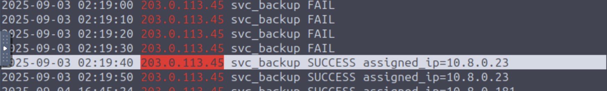
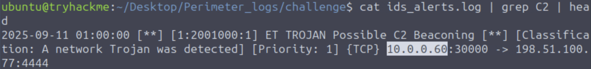
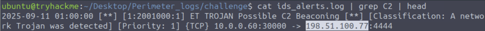
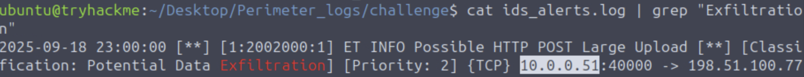

## Snapped Phishing-Line Step by Step Documentation and Answers

### 1) Examine the firewall logs. What external IP performed the most reconnaissance?

> Since we are looking for port scans, I looked for blocked connection attempts in the logs, then filtered for the source IP and
sorted by count.

### 2) In the firewall log, Which internal host was targeted by scans?
> For this I summarized which destination IP received the most hits. 

### 3) Which username was targeted in VPN logs?
> In the VPN logs, I filtered for the attacker IP and manually searched in logs.

### 4) What internal IP was assigned after successful VPN login?
> I manually searched the VPN logs using the previous command to see what IP address they first received.

### 5) Which port was used for lateral SMB attempts?
> The port used for SMB is 445.

### 6) In the IDS logs, which host beaconed to the C2?
> Looking at the IDS logs, filtered for C2 and observed the source IP.

### 7) During the investigation, which IP was observed to be associated with C2?
> Looking at the IDS logs, filtered for C2 and observed the destination IP.

### 8) Which host showed the exfiltration attempts?
> Looking at the IDS logs, filtered for "Exfiltration" and observed the source IP.

